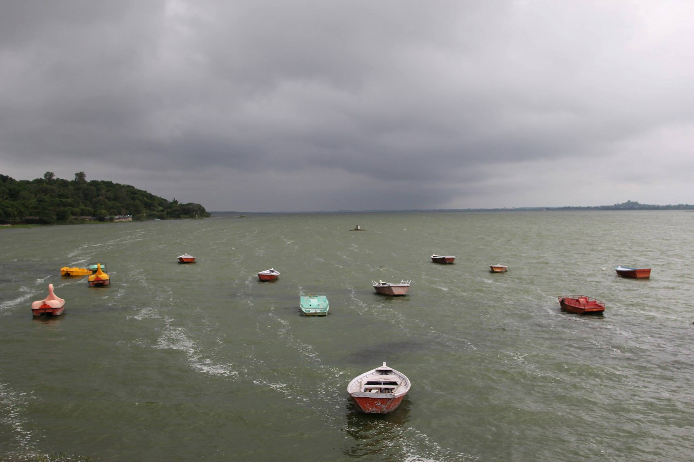
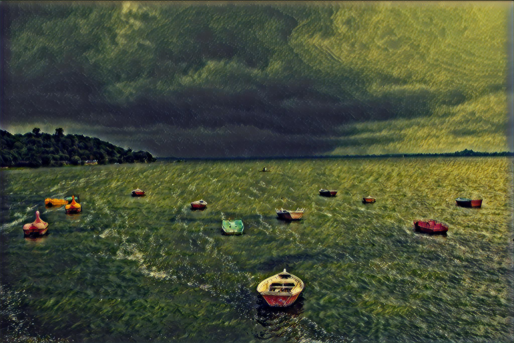
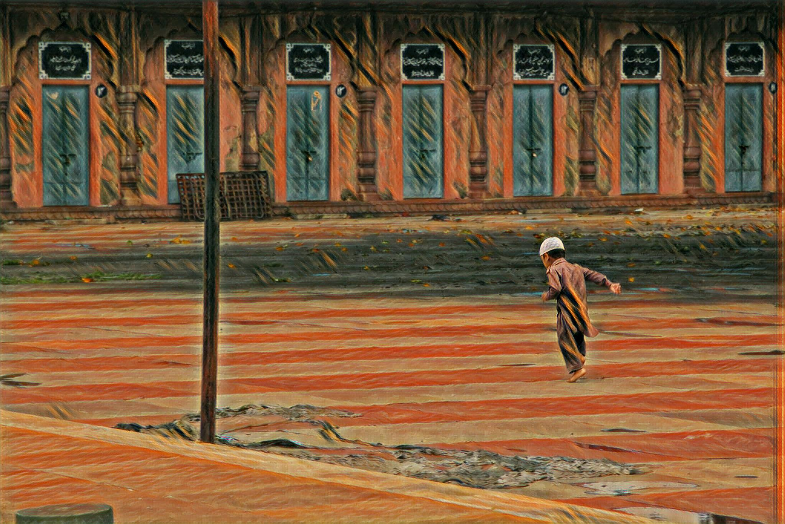
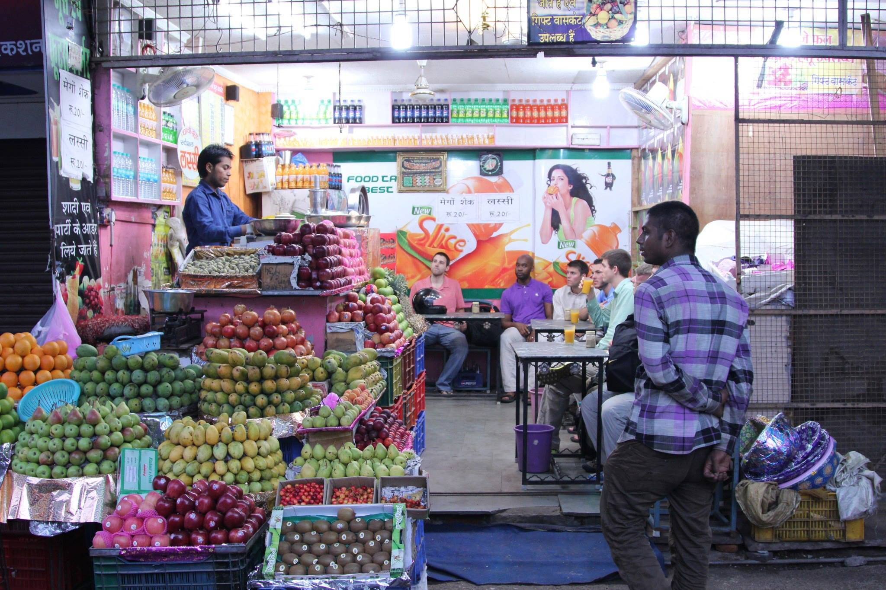
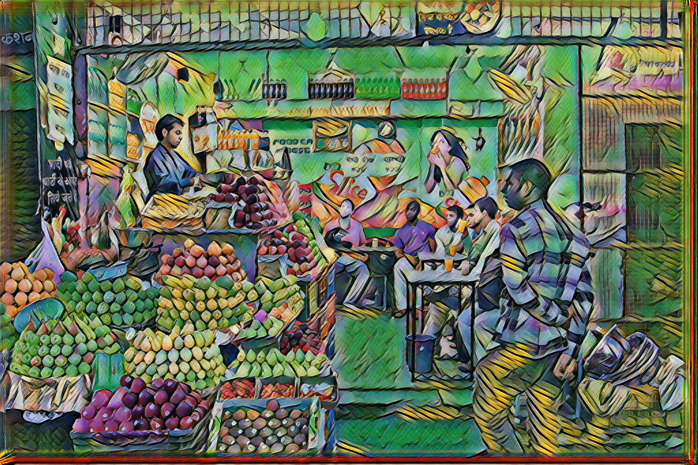
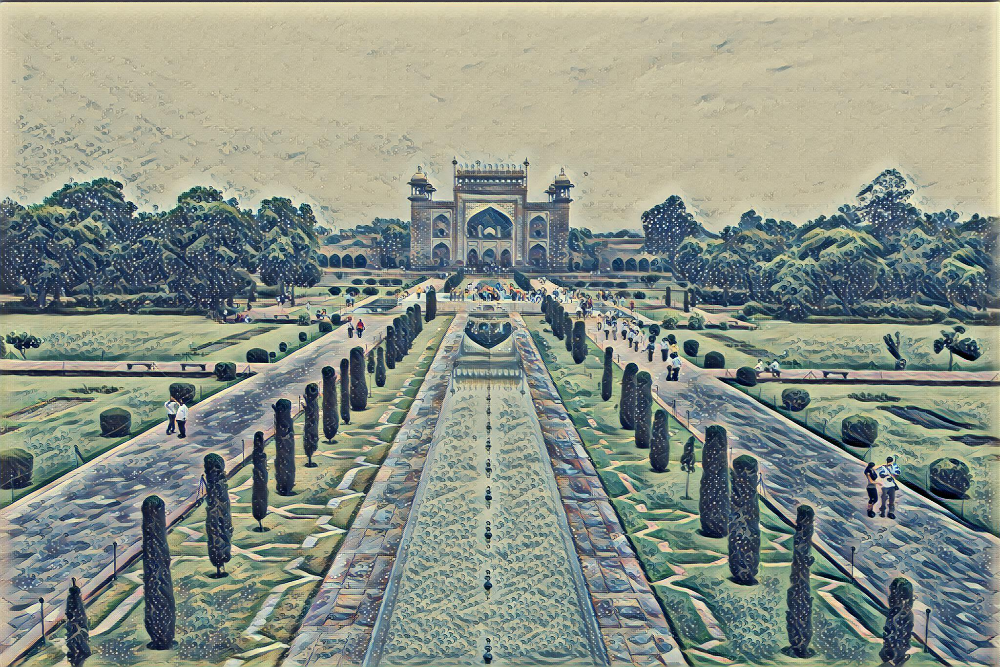

## Fast TensorFlow Style Transfer Fun

###From lengstrom

## Style Transfer on India Photos
Forked this from lengstrom. I'm feeding pictures my friend took when we were in India to deep learning models that have been trained on different classic paintings. The models are applying the styles they learned to the pictures and producing the output you see here. The results were pretty cool. Take a look!

<p align = 'center'>


<a href = 'examples/results/wreck_boats.jpg'></a>
</p>
<p align = 'center'>
</p>

<p align = 'center'>


<a href = 'examples/results/child_scream.jpg'></a>
</p>
<p align = 'center'>
</p>

<p align = 'center'>


<a href = 'examples/results/fruit_muse.jpg'></a>
</p>
<p align = 'center'>
</p>

<p align = 'center'>


<a href = 'examples/results/wave_taj.jpg'></a>
</p>
<p align = 'center'>
</p>


## Implementation Details
Their implementation uses TensorFlow to train a fast style transfer network. They use roughly the same transformation network as described in Johnson, except that batch normalization is replaced with Ulyanov's instance normalization, and the scaling/offset of the output `tanh` layer is slightly different. They use a loss function close to the one described in Gatys, using VGG19 instead of VGG16 and typically using "shallower" layers than in Johnson's implementation (e.g. we use `relu1_1` rather than `relu1_2`). Empirically, this results in larger scale style features in transformations.


### Citation
```
  @misc{engstrom2016faststyletransfer,
    author = {Logan Engstrom},
    title = {Fast Style Transfer},
    year = {2016},
    howpublished = {\url{https://github.com/lengstrom/fast-style-transfer/}},
    note = {commit xxxxxxx}
  }
```


### License
Copyright (c) 2016 Logan Engstrom. Contact me for commercial use (email: engstrom at my university's domain dot edu). Free for research/noncommercial use, as long as proper attribution is given and this copyright notice is retained.

